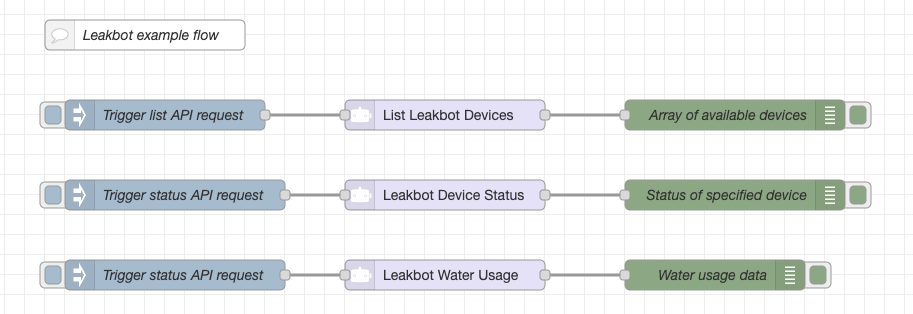

# node-red-contrib-leakbot

## Leakbot Node Red Nodes

## Description

A set of nodes allowing communication with the [Leakbot](https://leakbot.io) API.

## Nodes

### List Leakbot Devices

Get the devices avialble to the user.

#### Inputs

The node disrespects any input. It will only serve as a trigger to get the status of the device.

#### Outputs

The node will output a array of objects containing information of the avilable devices.

### Leakbot Device Status

Get the status of a Leakbot device. Note that the device reports it's status to the cloud about once every 24 hours.

#### Inputs

The node disrespects any input. It will only serve as a trigger to get the status of the device.

#### Outputs

The node will output the status of the device of witch the id have been specified in the settings as a object.

#### Details

The id of the device needs to be provided. This can be found by using the List Leakbot Devices node. In the output of that node there will be a array of objects containing the devices. Each object will have a id property. This id should be used in the Device ID field of this node.

### Leakbot Water Usage

Get the water usage data of a Leakbot device.

#### Inputs

The node disrespects any input. It will only serve as a trigger to get the status of the device.

#### Outputs

The node will output the water usage stats of the device of witch the id have been specified in the settings as a object.

#### Details

The id of the device needs to be provided. This can be found by using the List Leakbot Devices node. In the output of that node there will be a array of objects containing the devices. Each object will have a id property. This id should be used in the Device ID field of this node.

### Leakbot Credentials

Stores the credentials for the Leakbot API.

#### Note

Leakbot Only Allows One Login: If you use theese nodes the token your mobile app is connected to becomes invalid and you get logged out. This happens also if you re-log back into the app it invalidates the token for the nodes, however the nodes should automatically re-authenticate.

## Disclaimer

This is not an official Leakbot product. This is a community project and is not affiliated with Leakbot. Use at your own risk.
